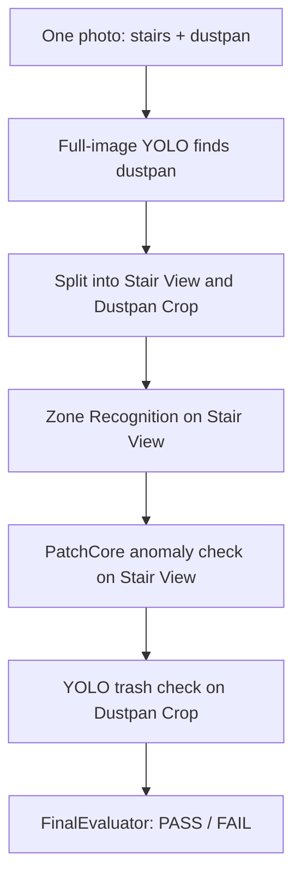

# EcoGuard AI

스마트폰 사진 1장으로 쓰레받이, 요청한 Zone/Checkpoint, 청소 상태를 검수하는 FastAPI와 별도 AI 자산 Build 파이프라인입니다. API는 학습을 실행하지 않으며, 필요한 실제 자산이 없으면 `MODEL_NOT_READY` 또는 `ZONE_MODEL_NOT_READY`를 반환합니다.

## AI workflow



## 개발 환경

Python 3.11을 사용합니다.

```powershell
py -3.11 -m venv .venv
.venv\Scripts\Activate.ps1
python -m pip install -r requirements.txt
```

Torch/Torchvision은 `requirements.txt`에 호환 버전으로 고정했습니다. Zone Encoder와 PatchCore는 ImageNet ResNet18 weight를 런타임에 다운로드하지 않습니다. 검증된 torchvision ResNet18 weight 파일을 다음 경로에 사전 배치해야 합니다.

```text
models/global/zone_encoder/resnet18-f37072fd.pth
```

Dustpan weight는 Training Pipeline이 실제 데이터로 생성하는 `models/global/dustpan/best.pt`입니다. 저장소는 어떤 가중치, 데이터, 추론 결과도 제공하지 않습니다.

## 서버

```powershell
uvicorn app.main:app --reload
```

- `GET /health`
- `POST /api/v1/cleaning/evaluate` (`multipart/form-data`: `image`, `zone_id`, `checkpoint_id`, optional `user_id`)

`/health`는 모델 자산이 없어도 200으로 서버 상태를 알리고, `models_ready`와 누락 자산을 함께 반환합니다. 청소 평가 요청은 JPEG/PNG 이미지 형식, 10 MB 업로드, 20 MP 픽셀 제한을 적용합니다.

경로와 런타임 제한은 환경 변수로 조정할 수 있습니다: `ECOGUARD_ROOT`, `ECOGUARD_DATASET_DIR`, `ECOGUARD_MODEL_DIR`, `ECOGUARD_ZONE_REGISTRY`, `ECOGUARD_DUSTPAN_WEIGHT`, `ECOGUARD_ZONE_ENCODER_WEIGHT`, `ECOGUARD_MAX_UPLOAD_BYTES`, `ECOGUARD_MAX_IMAGE_PIXELS`, `ECOGUARD_MAX_INFERENCE_CONCURRENCY`, `ECOGUARD_IMAGE_SIZE`.


## Zone Registry

`configs/zones.yaml`에 Zone/Checkpoint를 등록합니다. 초기 Registry는 비어 있습니다.

```yaml
zones:
  main_stair_a:
    display_name: 본관 계단 A
    active: true
    checkpoints:
      f1_f2:
        reference_bank: models/zones/main_stair_a/f1_f2/reference_embeddings
        patchcore: models/zones/main_stair_a/f1_f2/patchcore
        zone_threshold: null
        anomaly_threshold: null
```

Threshold는 Training Pipeline에서 분리된 positive/negative validation 점수로 계산하여 Checkpoint `metadata.json`에 보관합니다. Registry의 threshold 항목은 사람이 확인하기 위한 초기 null 필드이며, API 런타임 값은 생성 metadata에서 읽습니다.

## Dataset 배치

이미지는 JPG/JPEG/PNG로 준비하고, train/validation 간 같은 촬영 세션은 섞지 않습니다. Zone/PatchCore에는 쓰레받이가 없는 계단 사진도 넣을 수 있습니다. 쓰레받이가 사진에 보이면 빌드 때 검출해 가리고, 추론 때도 같은 규칙을 씁니다.

```text
datasets/raw/
├── dustpan/
│   ├── images/{train,val}/<image>.jpg
│   └── labels/{train,val}/<image>.txt
├── zones/<zone_id>/<checkpoint_id>/
│   ├── reference/<image>.jpg
│   └── validation/positive/<image>.jpg
├── zones/negative/<zone_id>/<checkpoint_id>/<image>.jpg
└── patchcore/<zone_id>/<checkpoint_id>/
    ├── train/normal/<image>.jpg
    └── val/{normal,anomaly}/<image>.jpg
```

Dustpan YOLO label은 이미지와 같은 basename의 UTF-8 `.txt`이며 각 줄은 `class_id x_center y_center width height` normalized 값입니다(0=dustpan, 1=trash). 빈 label은 객체 없는 YOLO 학습 사진에 허용됩니다.

Zone reference/validation과 PatchCore 사진은 계단 장면입니다. Zone negative는 다른 Zone/Checkpoint 또는 미등록 장소여야 합니다. PatchCore Train에는 정상 사진, Validation/Test에는 정상과 이상 사진이 필요합니다. 추론 사진 한 장에는 계단과 쓰레받이가 함께 있어야 합니다. 코드가 전체 사진에서 pan을 검출해 Stair View에서는 가리고, Dustpan Crop은 YOLO trash 검사에 사용합니다.


## Training / Build

```powershell
python -m training.run_pipeline --component dustpan
python -m training.run_pipeline --component zone --zone-id main_stair_a --checkpoint-id f1_f2
python -m training.run_pipeline --component patchcore --zone-id main_stair_a --checkpoint-id f1_f2
python -m training.run_pipeline --component all
```

기존 유효 자산은 기본적으로 덮어쓰지 않습니다. 재생성하려면 `--force`를 지정합니다. Dataset/label 누락은 `DATASET_NOT_READY`, 형식 오류는 `INVALID_DATASET`으로 보고됩니다. Dustpan은 pretrained `.pt`가 아닌 Ultralytics YAML architecture에서 초기화하며, 위 명령을 직접 실행할 때만 학습합니다.

## 테스트

```powershell
python -m pytest
```

테스트는 작은 Fixture를 사용하며 실제 사진, 가중치, 가짜 추론 결과를 생성하지 않습니다.

## 범위 및 OPEN ISSUE

현재 구현 범위는 `TASK.md`의 Phase 1–3입니다. 요청에 적힌 `TASKS.md`는 없고 `TASK.md`에 Phase 정의가 있습니다. `docs/AI_CONVENTIONS.md`도 아직 없습니다. 실제 Dataset, Dustpan weight, 로컬 ResNet18 weight, Zone Reference Bank, PatchCore Memory Bank가 없어 실제 학습과 AI 추론은 실행하지 않았습니다.
